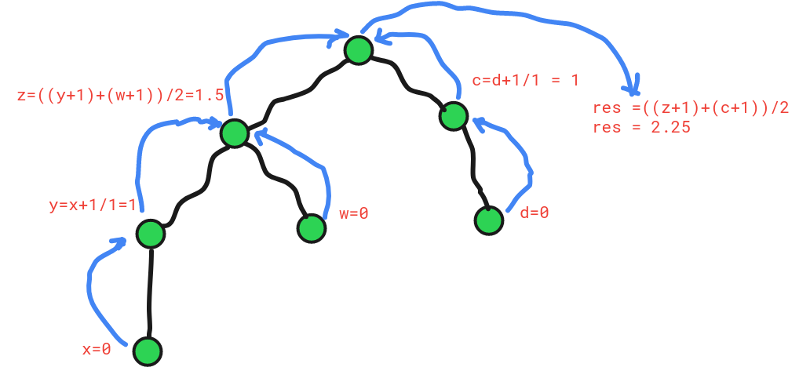

# Journey[***Problem Link***](https://codeforces.com/problemset/problem/839/C)

## problem simplified:
Given a tree. The length of each edge is `1`. You start form node 1 and each time you choose any adjacent node and go there(untill you go to a leaf). You can't visit an edge twice. Find the expected length of your visited path.

### The figure below shows how the dfs function returning the values in each step(return values are in red color) </br>

 

## observations
- Given graph is a tree
- Let you are in node x. from there you have `n` adjacent node you can go each having expected length: E1, E2,...En. then Expected value form node x is-

            `Ex = { (E1+1) + (E2+1) + ....+(En+1) } / n`
 


## **Solution Code(C++)**

```C++

    #include <bits/stdc++.h>
    using namespace std;
    #define lli long long int
    #define lf long double

    vector<lli>grp[100006];

    lf dfs(lli src, lli p){
        
        lf expected = 0;
        lf path = 0;
        for(int i=0; i<grp[src].size(); i++){
            int nxt = grp[src][i];
            if(nxt != p){
                expected += 1+dfs(nxt, src);
                path++;
            }
        }
        if(path == 0) return 0;
        return (expected / path);
    }

    int main() {
        lli n; cin>>n;
        for(int i=1; i<n; i++){
            lli u, v; cin>>u>>v;
            grp[u].push_back(v);
            grp[v].push_back(u);
        }
        cout << fixed << setprecision(15);
        cout<<dfs(1,-1);
    }
    
```
